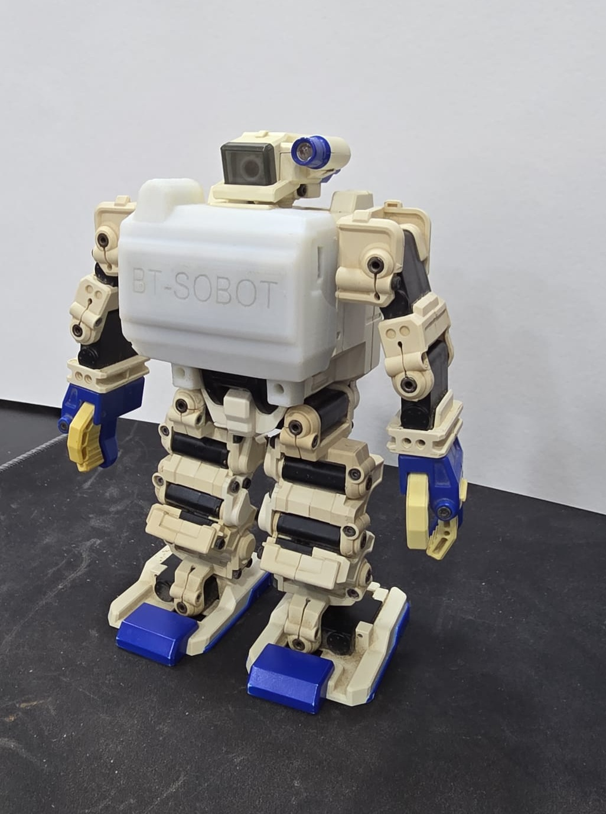

# Isobot-BT

This repository contains the Arduino Nano firmware, helper library, and native Android controller app for the BT-enabled I-Sobot / BT-SOBOT mod.

## Hardware

- Arduino Nano v3
- HC-05 Bluetooth module on digital pins `3` and `4`
- IR LED on digital pin `5`
- Li-Ion battery and charge/protection board mounted inside the robot body

The firmware sends the same IR codes as the original remote, while the Android app talks to the HC-05 over classic Bluetooth SPP.

## Firmware

Primary sketch:
`ISOBOT_BT_V1.2/ISOBOT_BT_V1.2.ino`

What it supports:

- indexed robot actions `0..138`
- repeated transmission for quick movement commands `0..11`
- raw service commands via `RAW:<ir-code>`
- T-pose calibration support inferred from the original remote sequence `4,4,4,B`

## Android App

Android project:
`Android/`

Current Android release line:
`v1.1.0`

Highlights:

- paired HC-05 device picker
- quick controls and full command catalog
- categorized search/filter UI
- bundled 3D robot preview
- bundled in-app PDF manual viewer for `Actions.pdf` and `Service_Manual.pdf`
- settings menu with T-pose servo-adjust action
- phone-friendly stacked layout and larger launcher icon

## Build Notes

Android:

- open `Android/` in Android Studio or run the Gradle wrapper there
- release builds read signing values from `Android/keystore.properties` or `ISOBOT_*` environment variables
- release APK output:
  `Android/app/build/outputs/apk/release/app-release.apk`

Arduino:

- board: Arduino Nano
- upload target that worked for this hardware:
  `arduino:avr:nano:cpu=atmega328old`

## End-To-End Notes

- pair the phone with the HC-05 first in Android Bluetooth settings
- install the matching Android APK and Arduino firmware together
- the Android T-pose action requires the updated firmware because it uses the `RAW:` serial path

## Release History

- `v1.1.0`
  - Android controller polish pass with embedded manuals, 3D preview, responsive layout, settings menu, and T-pose support
  - firmware updated to accept `RAW:<ir-code>` messages for service actions
- `v1.0.0`
  - initial Android controller release

## Media

- front cover STL model: https://www.thingiverse.com/thing:4692748
- demonstration video: https://www.youtube.com/watch?v=bPYBV43UScA
